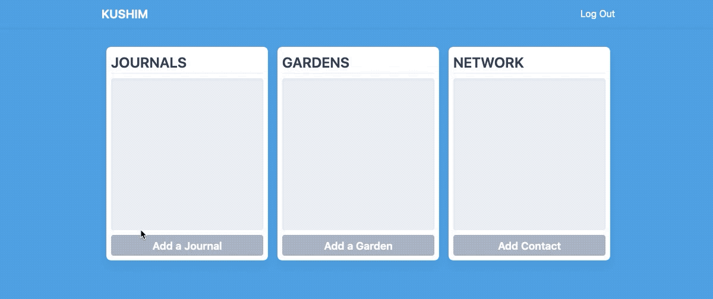
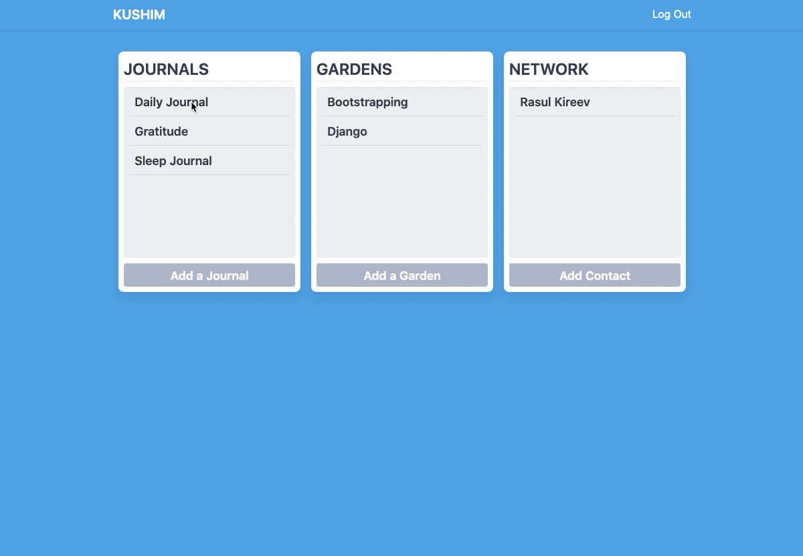

# Kushim
## Open Source Minimalist Life Management Tool

### About
This project is way for me to learn Django. Started with a Journaling app that was inspired by [Derek Sivers](http://sivers.org) [post on Journaling](https://sivers.org/dj). Then I wanted to add a bookmark catalog (Digital Garden) and a Personal CRM (like MonicaHQ).

If you have any questions about the app please feel free to reach out to me. I will try to answer any questions you might have.

### The future of the app

I decided to stop the development process of the app due to the lack of interest from public and me. I have found better tools to suit my needs. I don't plan to make any corrections / improvements any time soon.

### Screenshots

**Adding Journals, Gardens and Contacts**

**Adding Entries**
